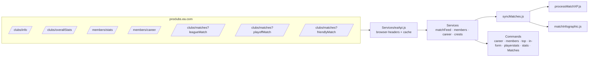

## Objective

Swap the bot's stats data source from the third-party `api.ourproclub.app` proxy to the **official EA Pro Clubs API** (7 endpoints), restructure every consumer for the new payload shape, migrate `linked_players` to use `playerId`, aggregate the three match-types (league/playoff/friendly) into one ordered match feed, add **/career**, **/members**, **/top**, **/in-form**, restructure **/playerstats**, and render club crests everywhere via `crestAssetId`.

---

## Confirmed Decisions

- **In-form** = top per stat over the last N matches (N selected by user as 5 or 10).
- **/top** = top 3 per stat across **all** member stats.
- **Linked players** = migrate to `playerId` (option b). Existing `linked_players` rows (currently keyed by gamertag) will be re-resolved via name match against the next members API fetch; if no match, the row is left as legacy and the user must `/claim` again.
- **Railway EA access** = unverified (SSH session hung). I'll add a one-shot startup self-test that logs the result, and if it fails on first deploy we'll add a proxy.
- **/playerstats** = dropdown sourced from `linked_players` of the current Discord guild.
- **Stats wipe** = the `players` stats table will be cleared and rebuilt from scratch from the new APIs.

---

## Verified API Shapes (from live calls)

```
clubs/info        → { [clubId]: { name, customKit: { crestAssetId, ... }, ... } }
clubs/overallStats→ [{ wins, losses, ties, goals, goalsAgainst, gamesPlayed, skillRating, wstreak, unbeatenstreak, lastMatch0..9, lastOpponent0..9, ... }]
members/stats     → { members: [{ name, gamesPlayed, goals, assists, ratingAve, passesMade, passSuccessRate, tacklesMade, tackleSuccessRate, shotSuccessRate, manOfTheMatch, redCards, cleanSheetsDef, cleanSheetsGK, prevGoals0..10, proName, proPos, proOverall, favoritePosition, ... }], positionCount }
members/career    → { members: [{ name, proPos, gamesPlayed, goals, assists, manOfTheMatch, ratingAve, prevGoals, favoritePosition }], positionCount } (much narrower than members/stats)
clubs/matches     → [{ matchId, timestamp, timeAgo, clubs: { [clubId]: { goals, goalsAgainst, result, score, matchType, details: { name, customKit: { crestAssetId } } } }, players: { [clubId]: { [playerId]: { playername, pos, archetypeid, rating, goals, assists, passesmade, passattempts, tacklesmade, tackleattempts, cleansheetsdef, cleansheetsgk, mom, redcards, shots, saves, secondsPlayed, ... } } }, aggregate }]
```

Match player keys are numeric `playerId`. `playername` matches members API `name` exactly (verified: `M10V98` → `186092002`, `Peaty17HFC` → `889575770`).

Crest URL pattern: `https://eafc24.content.easports.com/fifa/fltOnlineAssets/24B23FDE-7835-41C2-87A2-F453DFDB2E82/2024/fcweb/crests/256x256/l{crestAssetId}.png`. Source: `info.{clubId}.customKit.crestAssetId` (preferred) and falls back to `match.clubs[clubId].details.customKit.crestAssetId`.

---

## Architecture



---

## Files To Change

### Replace / Rewrite

- **`src/Services/eaApi.js`** — new module exposing one function per endpoint. Single shared fetch with browser-like headers (`User-Agent`, `Referer: https://www.ea.com/`, `Origin`). Per-endpoint TTL cache (e.g., info 1h, overallStats 5m, members 2m, career 10m, matches 60s). 15s timeout, single retry on 5xx.
  - Exports: `getClubInfo(clubId)`, `getOverallStats(clubId)`, `getMembersStats(clubId)`, `getMembersCareer(clubId)`, `getMatches(clubId, type)`, `getRecentMatches(clubId, { limit })` ← merges league + playoff + friendly sorted by `timestamp` desc, takes top N.

- **`src/Services/syncMatches.js`** — switch to `getRecentMatches(clubId, { limit: 1 })`, treat `match.matchId` as canonical id, traverse `match.clubs[ourClubId]` and `match.players[ourClubId]` (current code uses `match.match_data.clubs` / flat `player_data`).

- **`src/Services/processMatchXP.js`** — rewrite to consume new player shape (`match.players[ourClubId][playerId]` with EA field names: `passesmade`, `passattempts`, `tacklesmade`, `tackleattempts`, `cleansheetsdef`/`cleansheetsgk`, `mom`, `redcards`). Persist by `playerId`.

- **`src/Services/matchInfographic.js`** — adapt extraction to new shape; render club crest fetched via `getCrestUrl(clubId)` for both teams (replace any default badge logic).

- **`src/Utils/scoreboard.js`** — update field references (`details.name`, `goals`, `goalsAgainst`).

- **`src/Commands/stats.js`** — switch to `getOverallStats` + lightweight derivation; show recent form (`lastMatch0..9` decoded: `1=W, 2=L, 3=D` per EA conventions; will verify against current data — may differ).

- **`src/Commands/Matches.js`** — switch to merged feed across the three match types.

- **`src/Commands/playerstats.js`** — three modes:
  1. No option → caller's own linked player.
  2. `user:` (Discord user option) → look up that user's linked playerId.
  3. Autocomplete `player:` → suggest current Discord-server members from `linked_players`.

- **`src/Commands/claim.js`** — rebuild dropdown from `getMembersStats` (was sourcing from old shape); persist `playerId` + `name`.

- **`src/Commands/syncstats.js`** — rebuild totals by replaying merged matches into a fresh `players` table.

- **`src/Services/autoStatsSync.js`** — switch underlying calls to `getMembersStats` (no replay needed for season totals; let it just refresh cached members + overallStats).

### New

- **`src/Services/crests.js`** — `getCrestUrl(clubId)` returning the Asset URL. Tries `getClubInfo` first, falls back to scanning latest match's `clubs[clubId].details.customKit.crestAssetId`. Memoized in-process for the session.

- **`src/Commands/career.js`** — `/career` slash command. Optional `user:` (Discord user) or `player:` (autocomplete from server's linked_players). Default = caller's link. Renders an embed of `gamesPlayed, goals, assists, manOfTheMatch, ratingAve, favoritePosition, proPos` from `members/career`. Crest as embed thumbnail.

- **`src/Commands/members.js`** — `/members`. Pulls `getMembersStats` and renders one embed (or paginated buttons if >10) listing every member with key columns: `name | GP | G | A | RatingAve | MOTM | WinRate%`. Crest as thumbnail.

- **`src/Commands/top.js`** — `/top`. Builds top-3 leaderboards across these member-stat fields:
  `gamesPlayed`, `goals`, `assists`, `ratingAve`, `manOfTheMatch`, `winRate`, `passesMade`, `passSuccessRate`, `tacklesMade`, `tackleSuccessRate`, `shotSuccessRate`, `cleanSheetsDef`, `cleanSheetsGK`, `redCards` (lowest-better). One embed, each stat as a field listing top 3 (`#1 name — value`). Tie-break: secondary sort by `gamesPlayed` desc.

- **`src/Commands/inform.js`** — `/in-form`. Slash option `last:` choices `5` or `10`. Pulls merged matches (league+playoff+friendly), takes the last N by timestamp, aggregates per-player from `match.players[ourClubId]`, then for each member-stat field shows top 5 over those N games. Uses match-level fields available in player payloads (`goals`, `assists`, `rating`, `passesmade`, `passattempts`, `tacklesmade`, `tackleattempts`, `mom`, `cleansheetsdef`/`cleansheetsgk`, `redcards`, `shots`, `saves`). Average rating uses `rating` mean across appearances.

### Schema migration (`src/Utils/db.js`)

- `linked_players`:
  ```sql
  CREATE TABLE linked_players (
      discord_id TEXT PRIMARY KEY,
      guild_id   TEXT,
      player_id  TEXT,
      player_name TEXT
  );
  CREATE UNIQUE INDEX idx_linked_player_id ON linked_players(player_id);
  ```
  (`ensureColumn` adds `guild_id`, `player_id`; existing rows keep `player_name`. On bot start, if `player_id` is null and we have a current members fetch, attempt to backfill by name match.)

- `players`:
  ```sql
  CREATE TABLE players (
      player_id TEXT PRIMARY KEY,
      player_name TEXT,
      guild_id TEXT,
      ... (existing counters)
  );
  ```
  Existing `players` table is **dropped and recreated** on first run after deploy (per "start fresh" decision). A one-time `_schema_meta` row gates this so it only happens once.

- `processed_matches`: unchanged (keyed by EA `matchId`).

### Other

- **`src/Utils/cache.js`** — generalise from match-only to keyed cache (`get(key, ttlMs)` / `set(key, value)`); replace existing match cache.

- **`src/index.js`** — add startup self-test: call `getClubInfo` for any linked guild's `club_id` and log `EA self-test: <ok|status|error>`. Non-fatal.

---

## Match Feed Aggregation

```js
async function getRecentMatches(clubId, { limit = 50 } = {}) {
    const [league, playoff, friendly] = await Promise.all([
        getMatches(clubId, "leagueMatch"),
        getMatches(clubId, "playoffMatch"),
        getMatches(clubId, "friendlyMatch")
    ]);
    return [...league, ...playoff, ...friendly]
        .filter(m => m && m.matchId && m.timestamp)
        .sort((a, b) => Number(b.timestamp) - Number(a.timestamp))
        .slice(0, limit);
}
```

`maxResultCount=100` per type as you specified. Cache each per-type result for 60s so the merge cost is negligible.

---

## Crest URL Helper

```js
function buildCrestUrl(crestAssetId) {
    if (!crestAssetId) return null;
    return `https://eafc24.content.easports.com/fifa/fltOnlineAssets/`
         + `24B23FDE-7835-41C2-87A2-F453DFDB2E82/2024/fcweb/crests/256x256/`
         + `l${crestAssetId}.png`;
}
```

`getCrestUrl(clubId)` resolves `crestAssetId` by:
1. `getClubInfo(clubId)` → `info[clubId].customKit.crestAssetId`
2. Fallback: latest league match → `clubs[clubId].details.customKit.crestAssetId`

Used in: `/career`, `/members`, `/top`, `/in-form`, `/stats`, `/playerstats`, `/Matches`, plus drawn into match infographic header (replacing whatever default is currently used).

---

## Risks & Mitigations

| Risk | Mitigation |
|---|---|
| EA blocks Railway's IP | Startup self-test logs `EA self-test: ...`; if blocked, plan B = add `EA_PROXY_URL` env var that wraps fetch |
| Existing linked players keyed by gamertag | Backfill `player_id` on first members fetch; legacy rows still work via `player_name` until backfill resolves |
| `lastMatch0..9` encoding ambiguity | Verify by comparing recent overallStats values to known wins/losses before relying on the format |
| Auto stats sync wiping in-progress data | Drop+rebuild gated by `_schema_meta` row, runs only once |
| Rate limits on EA endpoints | Per-endpoint TTL cache + single retry; never call inside hot loops |
| Discord embed/component limits (members > 25, autocomplete > 25) | Paginate `/members`; cap autocomplete at 25 with prefix filter |

---

## Step → Targets → Verification

| # | Step | Targets | Verification |
|---|---|---|---|
| 1 | Rewrite `eaApi.js` with 7 endpoints + browser headers + cache | `src/Services/eaApi.js`, `src/Utils/cache.js` | Unit-style script logs 200 + JSON for all 7 endpoints |
| 2 | Add `crests.js` helper | `src/Services/crests.js` | Smoke test: `getCrestUrl(6329547)` → returns valid URL with `l99160127` |
| 3 | DB migration (linked_players + players reset) | `src/Utils/db.js` | Boot once, confirm new columns exist, players table recreated, `_schema_meta.players_reset=1` |
| 4 | Migrate `syncMatches`/`processMatchXP`/`matchInfographic`/`scoreboard` to new shape | listed files | One real match feed cycle posts an infographic without errors |
| 5 | Migrate `stats`, `Matches`, `playerstats`, `claim`, `syncstats`, `autoStatsSync` | listed files | Each command runs end-to-end against the live club |
| 6 | Implement `/career`, `/members`, `/top`, `/in-form` | new files | Each shows expected data; commands register on deploy |
| 7 | Self-test on boot | `src/index.js` | Railway logs show `EA self-test: ok` |
| 8 | Lint + node syntax check + dry boot | all changed files | `node --check` per file passes; bot logs in locally without crash if `.env` provided |
| 9 | Commit + push to `main`; Railway auto-redeploys | git | Live deploy logs show successful start; `/members` returns data |

---

## Definition of Done

- All commands listed above register and respond without error on Railway.
- `EA self-test: ok` appears in startup logs.
- `/members`, `/career`, `/top`, `/in-form` show real data.
- Match infographic still posts via AutoMode using the new shape.
- Old proxy URL (`api.ourproclub.app`) appears nowhere in the codebase.
- Crest images appear in `/members`, `/career`, `/stats`, and the match infographic.

---

Two open items I'd like your call on before I start coding:

1. **`/in-form` window** — you said 5 or 10 selectable. Anything else you want allowed (e.g., 3, 20)?
2. **Match-feed `limit`** — should `/Matches` and the recency window for /in-form pull from a merged 100-per-type pool (300 total), or cap the merged pool at 100?
